<div align="center">



</div>

<br />

<!-- ================================================================== -->
<!-- HERO — three column: avatar / ascii identity / profile card        -->
<!-- ================================================================== -->

<table border="0" cellspacing="0" cellpadding="0">
<tr>
<td width="430" valign="top" align="center">



</td>
<td width="270" valign="top">

### `Adi Saputra`

**Network QoSE Engineer**

<br />

|                      |                       |
| -------------------- | --------------------- |
| 🎓 **Certification** | MTCNA                 |
| 📍 **Location**      | Indonesia             |
| 🎯 **Focus**         | Enterprise Monitoring |
| ⚙️ **Building**      | VELO QoSE Platform    |

<br />

`Enterprise Networking` `QoS/QoE`
<br />
`Automation` `Linux`

</td>
</tr>
</table>

<br />

<div align="center">


</div>

---

<br />

## Who Am I

I work at the layer where the network stops being an abstraction and starts being a customer's experience — call quality, meeting stability, application responsiveness. My job is to make sure that layer holds up under real conditions: contended links, asymmetric routing, congested peering, noisy WAN. I hold an **MTCNA** certification and spend most of my time in MikroTik RouterOS, Debian, and Python, connecting the dots between raw packet behavior and what a user actually perceives.

<br />

## About Me

I am an engineer focused on **enterprise networking, monitoring, troubleshooting, and automation** — not on collecting frameworks. Day to day, that means:

- Instrumenting networks to surface latency, jitter, and packet loss before a customer files a ticket about them
- Investigating root cause on degraded links: routing anomalies, QoS misconfiguration, saturation, and asymmetric paths
- Building automation around MikroTik RouterOS to reduce manual, repetitive network operations
- Translating raw telemetry into **QoE** — the actual experience of voice, video, and collaboration traffic across Teams, Zoom, Webex, and Meet
- Writing internal tooling in Python/Flask when off-the-shelf monitoring doesn't go deep enough

I care about signal over noise: dashboards that tell an on-call engineer exactly where to look, not ones that just look impressive.

<br />

## Current Focus

```text
[ACTIVE]  VELO QoSE Monitoring Platform — enterprise customer experience monitoring
[ACTIVE]  MikroTik RouterOS automation — reducing manual config & recovery time
[LEARNING] Deeper network automation patterns — Python-driven RouterOS orchestration
[ONGOING]  Packet loss & latency root-cause investigation across customer WAN links
```

<br />

## Technical Expertise

<table width="100%">
<tr>
<td width="50%" valign="top">

**Networking**
`Enterprise Networking` `Routing` `QoS / QoE` `MikroTik RouterOS` `Cloud Networking` `Traceroute & Route Quality Analysis`

**Operating Systems**
`Linux` `Debian`

**Programming**
`Python` `Flask`

</td>
<td width="50%" valign="top">

**Monitoring**
`Latency Monitoring` `Packet Loss Monitoring` `Jitter Monitoring` `Customer Experience Monitoring` `Enterprise Monitoring`

**Automation**
`Network Automation` `RouterOS Scripting`

**Tools**
`Chart.js` `AdminLTE`

</td>
</tr>
</table>

<br />

## Certifications

| Certification                                    | Issuer   | Status       |
| ------------------------------------------------ | -------- | ------------ |
| **MTCNA** — MikroTik Certified Network Associate | MikroTik | ✅ Certified |

<br />

## Featured Projects

<table width="100%">
<tr>
<td width="50%" valign="top">

### VELO QoSE Monitoring Platform

Enterprise network monitoring platform focused on customer-facing quality of experience — latency, packet loss, jitter, traceroute analysis, and route quality, plus dedicated monitoring for Microsoft Teams, Zoom, Cisco Webex, and Google Meet.

**Stack:** `Python` `Flask` `Debian` `MikroTik` `Chart.js` `AdminLTE`
**Status:** `🟢 Active development`

</td>
<td width="50%" valign="top">

### Network Automation Toolkit

Automation utilities for MikroTik RouterOS environments — configuration management and repeatable operational tasks aimed at cutting manual network administration.

**Stack:** `Python` `MikroTik RouterOS`
**Status:** `🟢 Active development`

</td>
</tr>
<tr>
<td width="50%" valign="top">

### Microsoft Teams Toolkit

Monitoring module purpose-built for Microsoft Teams call and meeting quality — surfacing degradation in real time from the network layer up.

**Stack:** `Python` `Flask` `Chart.js`
**Status:** `🟡 In progress`

</td>
<td width="50%" valign="top">

### Zoom Toolkit

Monitoring module tracking Zoom session quality metrics, correlated against underlying network conditions to isolate root cause faster.

**Stack:** `Python` `Flask` `Chart.js`
**Status:** `🟡 In progress`

</td>
</tr>
</table>

<br />

## Current Mission

Reduce the distance between **"the network is fine"** and **"the customer's experience is fine."** Most monitoring stacks measure the former; VELO exists to measure the latter — and to catch degradation in voice, video, and collaboration traffic before it becomes a support ticket.

<br />

## GitHub Statistics

<div align="center">


<br />


</div>

<br />

## Contribution Graph

<div align="center">


</div>

<br />

## Contribution Snake

<div align="center">


</div>

<sub>Generated automatically by the workflow in <code>.github/workflows/snake.yml</code>.</sub>

<br /><br />

## Visitor Counter

<div align="center">


</div>

<br />

## Contact

<div align="center">

| Channel     | Handle                                                 |
| ----------- | ------------------------------------------------------ |
| 🐙 GitHub   | [@adisaputra-prog](https://github.com/adisaputra-prog) |
| 📍 Location | Indonesia                                              |
| 🎯 Open to  | Enterprise networking & monitoring collaboration       |

</div>

<br />

---

<div align="center">

<sub>

`root@network:~$` **Adi Saputra** · Network QoSE Engineer · MTCNA Certified · Indonesia

Built with Python, RouterOS, and a low tolerance for unexplained packet loss.

</sub>

</div>
